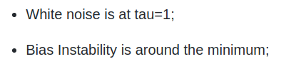
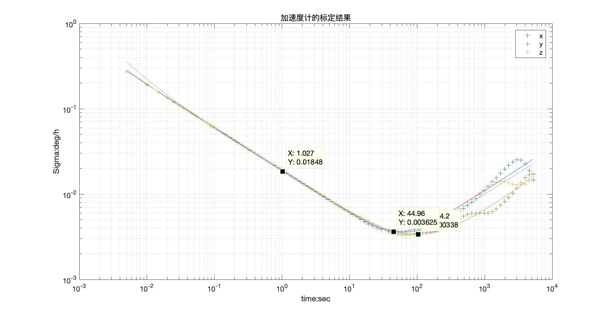
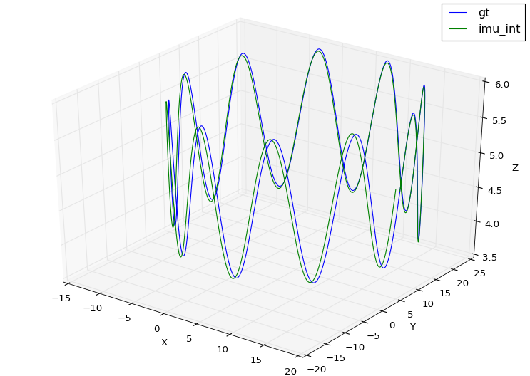
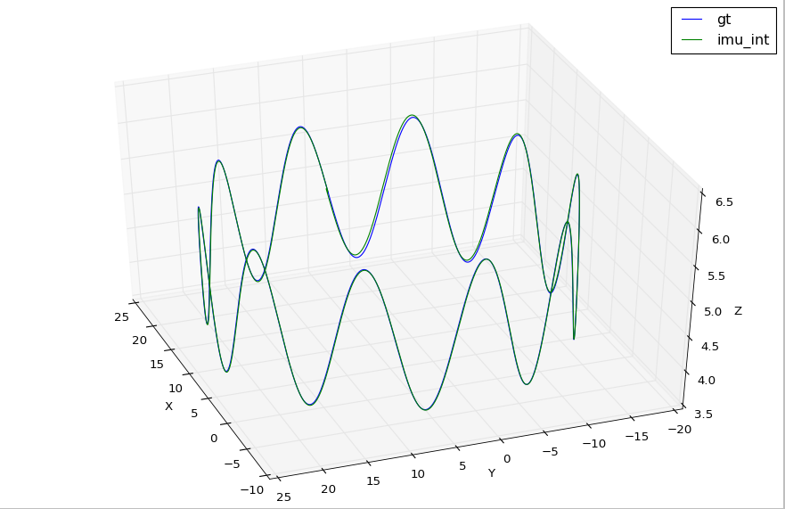
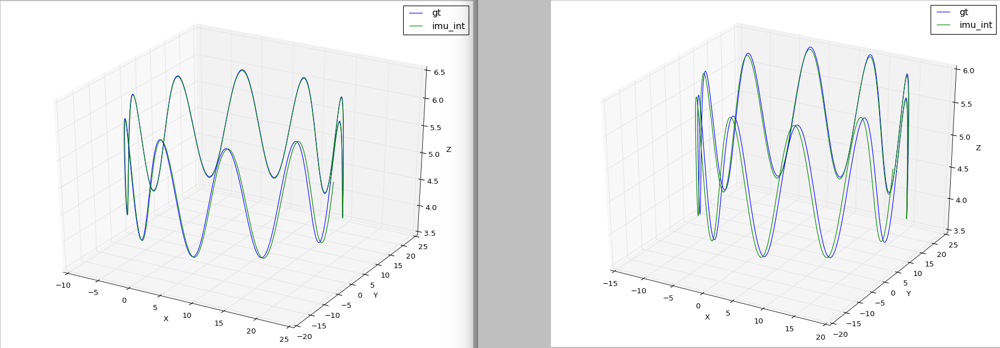

## 基础作业：
### 1.1 设置IMU仿真代码中不同参数，生成Allan方差标定曲线


---

首先根据allen标定方法：



知道白噪声和随机游走的两个关键地方分别是在t为1和曲线最小值部分。

我的四个误差设定如下：
```
// bias 随机游走噪声
double gyro_bias_sigma = 0.00003;
double acc_bias_sigma = 0.0008;

// noise 噪声
double gyro_noise_sigma = 0.005;    // rad/s    陀螺仪的高斯白噪声
double acc_noise_sigma = 0.010;     //　m/(s^2) 加速度的高斯白噪声
```

下图是我使用标定包 imu_utils输出的标定结果：

**加速度计**



**陀螺仪**


结果表明：

加速度计标定结果普遍优于陀螺仪的标定结果。

白噪声的标定结果要好于bias的结果。

跟白巧克力老师的结论差不多。

个人感悟是：随机的东西，能标定出来这样的效果，已经挺不错啦！

---

### 1.2 更改IMU仿真代码中的欧拉积分为中值积分

**中值法的关键代码：**

```cpp

        Eigen::Vector3d dtheta_half =  ((imupose.imu_gyro + imulastpose.imu_gyro)/2.0) * dt /2.0;
        dq.w() = 1;
        dq.x() = dtheta_half.x();
        dq.y() = dtheta_half.y();
        dq.z() = dtheta_half.z();
        // 旋转 这里的dq要做改动
        Qwb_last = Qwb;
        Qwb = Qwb * dq;
        Eigen::Vector3d acc_w = (Qwb_last*(imulastpose.imu_acc) + Qwb*(imupose.imu_acc))/2 + gw;
        // 速度
        Vw = Vw + acc_w * dt;
        // 位置
        Pwb = Pwb + Vw * dt + 0.5 * dt * dt * acc_w;

```

这部分我理解，我知道怎么做。

**使用欧拉法**



**使用中值法**


**对比图： 左边中值，右边欧拉**




清晰可见，中值法拟合出来的两条曲线更加贴近！

## 2. 阅读论文，撰写总结推导
