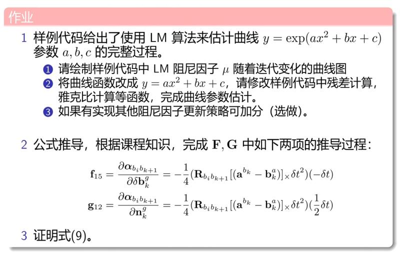
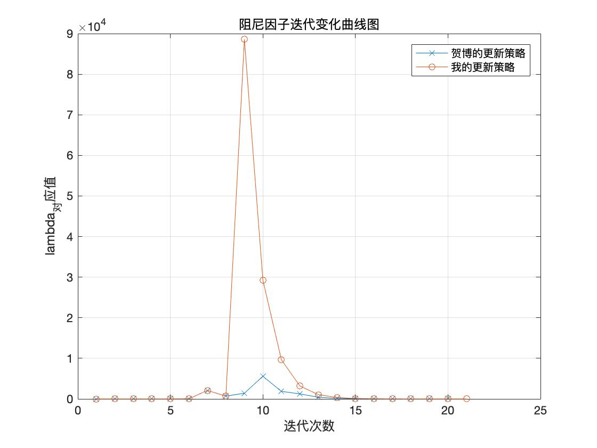
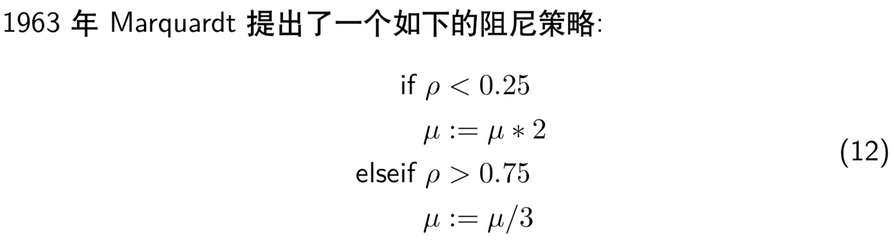
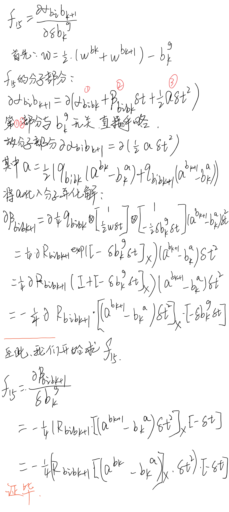
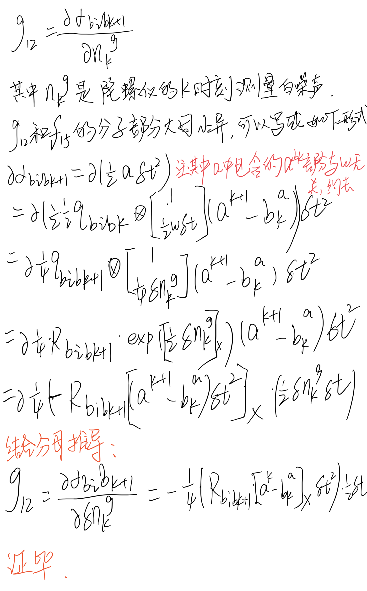
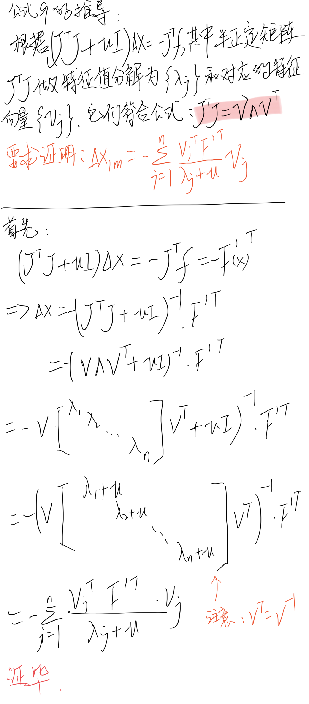

## 本次作业内容如下：😁




## 一、编程题😁

#### 1. 绘制阻尼因子的迭代变化曲线图

**这里用我的更新策略和贺博的更新策略两种输出阻尼曲线图做对比：**





**分析：**

可以看出，基本走向大家都差不多，我的可能会有点激进。导致多迭代一次。


**使用贺博源代码中更新策略的迭代结果：**

```json
iter: 0 , chi= 36048.3 , Lambda= 0.001
iter: 1 , chi= 30015.5 , Lambda= 699.051
iter: 2 , chi= 13421.2 , Lambda= 1864.14
iter: 3 , chi= 7273.96 , Lambda= 1242.76
iter: 4 , chi= 269.255 , Lambda= 414.252
iter: 5 , chi= 105.473 , Lambda= 138.084
iter: 6 , chi= 100.845 , Lambda= 46.028
iter: 7 , chi= 95.9439 , Lambda= 15.3427
iter: 8 , chi= 92.3017 , Lambda= 5.11423
iter: 9 , chi= 91.442 , Lambda= 1.70474
iter: 10 , chi= 91.3963 , Lambda= 0.568247
iter: 11 , chi= 91.3959 , Lambda= 0.378832
problem solve cost: 22.9298 ms
   makeHessian cost: 15.725 ms
-------After optimization, we got these parameters :
0.941939  2.09453 0.965586
-------ground truth:
1.0,  2.0,  1.0
```

#### 2. 修改残差计算和雅克比计算函数，完成曲线估计


**核心代码：**

```c++
// 计算曲线模型误差
virtual void ComputeResidual() override
{
    Vec3 abc = verticies_[0]->Parameters();  // 估计的参数
    residual_(0) = abc(0)*x_*x_ + abc(1)*x_ + abc(2)  - y_;  // 构建残差 预测值-测量值
}

// 计算残差对变量的雅克比
virtual void ComputeJacobians() override
{
    Vec3 abc = verticies_[0]->Parameters();
    // double exp_y =  abc(0)*x_*x_ + abc(1)*x_ + abc(2) ;

    Eigen::Matrix<double, 1, 3> jaco_abc;  // 误差为1维，状态量 3 个，所以是 1x3 的雅克比矩阵
    jaco_abc << x_ * x_ , x_ , 1; // 这里是分别对a, b, c求导生成的雅克比装进jaco_abc中
    jacobians_[0] = jaco_abc;
}

// 构造 N 次观测
   for (int i = 0; i < N; ++i) {
       double x = i/100.;
       double n = noise(generator);
       // 观测 y
       double y =  a*x*x + b*x + c  + n;
       //  double y = std::exp( a*x*x + b*x + c );

       // 每个观测对应的残差函数
       shared_ptr< CurveFittingEdge > edge(new CurveFittingEdge(x,y));
       std::vector<std::shared_ptr<Vertex>> edge_vertex;
       edge_vertex.push_back(vertex);
       edge->SetVertex(edge_vertex);

       // 把这个残差添加到最小二乘问题
       problem.AddEdge(edge);
   }

```

**输出结果：**

```json
iter: 0 , chi= 719.475 , Lambda= 0.001
iter: 1 , chi= 91.395 , Lambda= 0.000333333
problem solve cost: 2.45328 ms
   makeHessian cost: 1.91108 ms
-------After optimization, we got these parameters :
 1.61039  1.61853 0.995178
-------ground truth:
1.0,  2.0,  1.0
```
**分析：**

两次迭代完成，chi已经是很小了，但是a的估计有些出入，LM用在这个函数拟合上有些大才小用

#### 3. 实现其他阻尼因子更新策略

**我用的更新策略原理：**



**核心代码：**

```c++
if (rho > 0 && isfinite(tempChi))
{
    if (rho < 0.25){
        ni_ = 2;
        currentLambda_ *= ni_;
    }else if (rho > 0.75){
        currentLambda_ *= 0.33;
    }
    currentChi_ = tempChi;
    return true;
} else {
    currentLambda_ *= ni_;
    ni_ *= 2;
    return false;
}
```

**使用我的更新策略的迭代结果：**

```json
iter: 0 , chi= 36048.3 , Lambda= 0.001
iter: 1 , chi= 30015.5 , Lambda= 692.06
iter: 2 , chi= 29217.7 , Lambda= 29232.6
iter: 3 , chi= 26227.2 , Lambda= 9646.76
iter: 4 , chi= 11290.5 , Lambda= 3183.43
iter: 5 , chi= 2229.93 , Lambda= 1050.53
iter: 6 , chi= 158.185 , Lambda= 346.676
iter: 7 , chi= 105.331 , Lambda= 114.403
iter: 8 , chi= 100.254 , Lambda= 37.753
iter: 9 , chi= 95.1615 , Lambda= 12.4585
iter: 10 , chi= 91.9953 , Lambda= 4.1113
iter: 11 , chi= 91.418 , Lambda= 1.35673
iter: 12 , chi= 91.396 , Lambda= 0.447721
iter: 13 , chi= 91.3959 , Lambda= 0.895441
   makeHessian cost: 12.3481 ms
-------After optimization, we got these parameters :
0.941887  2.09461  0.96556
-------ground truth:
1.0,  2.0,  1.0
```

**分析：**

1. 迭代次数比贺博版本多两次
2. 但是solve_time 时间要更加快
3. 最终输出的a,b,c参数基本没差别


## 二、分别证明两个误差传递雅各比f15和g12😅






## 三、公式9推导😳



