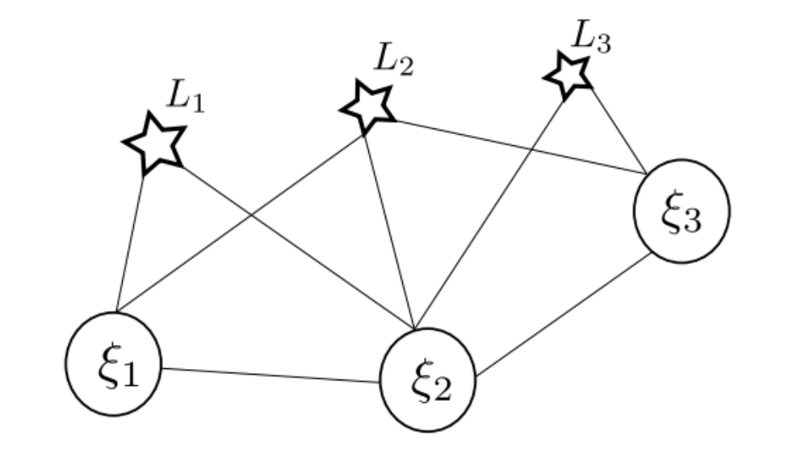
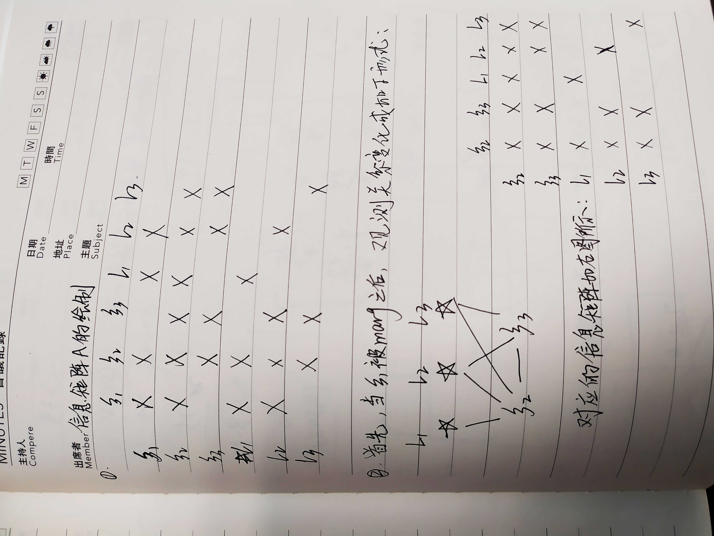
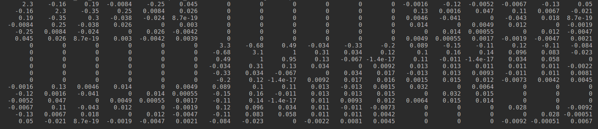

## 一、给定SLAM系统中相机和路标点的观测关系，定义好对应的状态与残差。如下图：


作业要求：
1. 绘制该系统的信息矩阵A.
2. 绘制第一帧相机被marg后的信息矩阵A’




## 二、补充代码Bundle Adjustment信息矩阵的计算，并输出正确结果

正确结果为：奇异值最后7维接近0，表明零空间的维度为7.

**回答**

补全信息矩阵块的关键部分：

```cpp
H.block(i*6,i*6,6,6) += jacobian_Ti.transpose() * jacobian_Ti;
// todo: 请补充完整作业信息矩阵块的计算
H.block(j*3 + 6*poseNums,j*3 + 6*poseNums,3,3) +=jacobian_Pj.transpose() * jacobian_Pj;
H.block(i*6,j*3 + 6*poseNums, 6,3) += jacobian_Ti.transpose() * jacobian_Pj;
H.block(j*3 + 6*poseNums, i*6 , 3,6) += jacobian_Pj.transpose() * jacobian_Ti;

```

程序最后7维的输出结果：
```
1.25708e-16
8.63763e-17
5.18689e-17
4.38809e-17
2.98776e-17
1.45304e-17
1.59456e-18
```

分析：

因为贺博已经给写好了两个H矩阵块，所以做作业实现起来很快，但是我想分析下这个H矩阵到底怎么拼接起来，以及最后的7维特征值为什么为0

1. 我这里修改特征点个数和位姿都为2,输出H矩阵查看样子：



矩阵H符合代码的实现过程，只有反对角线上是补充满的。因为我们认为相机的每个pose都可以看到所有的landmark。

残差项只产生在相机与landmark的连接线上。

2. 重投影模型：

```cpp
Eigen::Matrix<double,2,3> jacobian_uv_Pc;
jacobian_uv_Pc<< fx/z, 0 , -x * fx/z_2,
        0, fy/z, -y * fy/z_2;

Eigen::Matrix<double,2,3> jacobian_Pj = jacobian_uv_Pc * Rcw;
Eigen::Matrix<double,2,6> jacobian_Ti;
jacobian_Ti << -x* y * fx/z_2, (1+ x*x/z_2)*fx, -y/z*fx, fx/z, 0 , -x * fx/z_2,
                -(1+y*y/z_2)*fy, x*y/z_2 * fy, x/z * fy, 0,fy/z, -y * fy/z_2;

```
上面这个代码块中做重投影误差的jacobian求导。

x,y,z表示当前的landmark在这一帧相机坐标系中的位置。

其中2×3的矩阵块，表示的是特征点位姿的雅克比矩阵

2×6的矩阵块表示的是相机pose的雅克比矩阵

每个雅克比矩阵都是两行，是因为使用非其次归一化像素坐标，只有u,v两个维度。

这块内容很重要，无论是在后端的批量BA或者前端pnp求解相机和landmark状态时，都要用到上述的重投影误差模型。

我觉得，写雅克比矩阵是写BA中最费劲的地方。


3. 7维特征值为什么为0的具体含义：

所谓不可观问题，我们可以通过求解线性方程组的角度来理解，最后7维是0,说明，我有7个自由度的解空间，对于单目SLAM（本题中给出来的观测模型），就是有7个自由度的变化，可以得到同样的观测。说白了就是因为H矩阵不满秩。在这7个自由度的范围内，我们可以对该landmark生成同样数据的观测。
