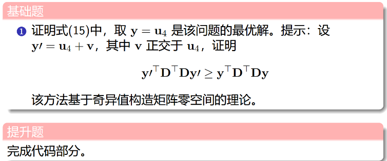
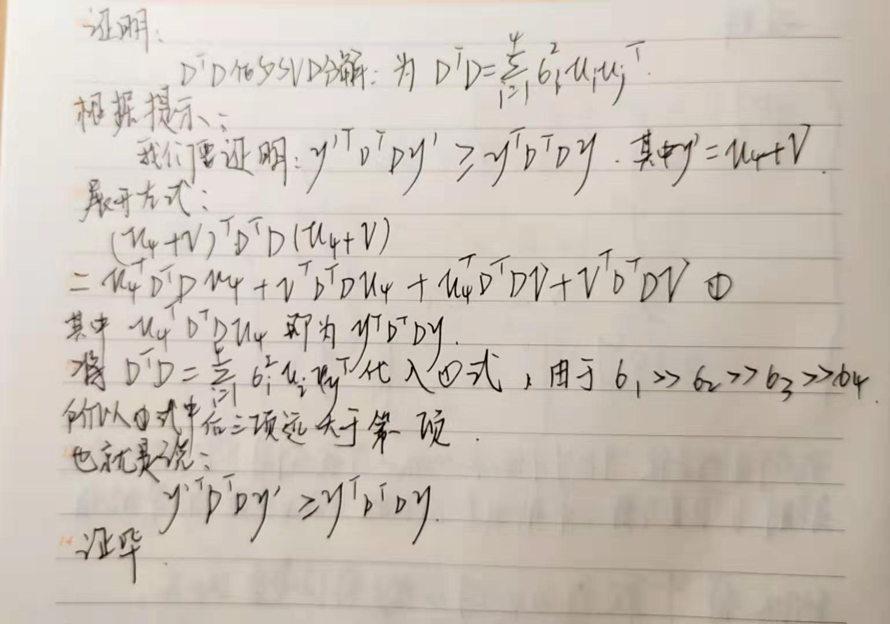
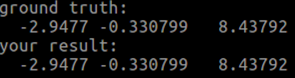

## 作业题目：



## 第一题：



## 第二题：

关键代码部分：
```cpp
//
// Created by allenhsu.
//
#include <iostream>
#include <vector>
#include <random>  
#include <Eigen/Core>
#include <Eigen/Geometry>
#include <Eigen/Eigenvalues>
#include <Eigen/SVD>

using namespace Eigen;
using namespace std;
// 定义pose结构体
struct Pose
{
    Pose(Eigen::Matrix3d R, Eigen::Vector3d t):Rwc(R),qwc(R),twc(t) {};
    Eigen::Matrix3d Rwc;
    Eigen::Quaterniond qwc;
    Eigen::Vector3d twc;

    Eigen::Vector2d uv;    // 这帧图像观测到的特征坐标
};
int main()
{

    int poseNums = 10;
    double radius = 8;
    double fx = 1.;
    double fy = 1.;
    std::vector<Pose> camera_pose;
    for(int n = 0; n < poseNums; ++n ) {
        double theta = n * 2 * M_PI / ( poseNums * 4); // 1/4 圆弧
        // 绕 z轴 旋转
        Eigen::Matrix3d R;
        R = Eigen::AngleAxisd(theta, Eigen::Vector3d::UnitZ());
        Eigen::Vector3d t = Eigen::Vector3d(radius * cos(theta) - radius, radius * sin(theta), 1 * sin(2 * theta));
        camera_pose.push_back(Pose(R,t));
    }

    // 随机数生成 1 个 三维特征点
    std::default_random_engine generator;
    std::uniform_real_distribution<double> xy_rand(-4, 4.0);
    std::uniform_real_distribution<double> z_rand(8., 10.);
    double tx = xy_rand(generator);
    double ty = xy_rand(generator);
    double tz = z_rand(generator);

    Eigen::Vector3d Pw(tx, ty, tz);
    // 这个特征从第三帧相机开始被观测，i=3
    int start_frame_id = 3;
    int end_frame_id = poseNums;
    for (int i = start_frame_id; i < end_frame_id; ++i) {
        Eigen::Matrix3d Rcw = camera_pose[i].Rwc.transpose();
        Eigen::Vector3d Pc = Rcw * (Pw - camera_pose[i].twc);

        double x = Pc.x();
        double y = Pc.y();
        double z = Pc.z();
        // 归一化坐标uv
        camera_pose[i].uv = Eigen::Vector2d(x/z,y/z);
    }

    /// TODO::homework; 请完成三角化估计深度的代码
    Eigen::Vector3d P_est;           // 结果保存到这个变量
    P_est.setZero();
    /* your code begin */

    Eigen::Matrix<double,14,4> D;
    Eigen::Matrix<double,3,4> P;
    Eigen::Vector2d x;
    int count = 0;
    for (int j = start_frame_id; j < end_frame_id; ++j) {
        x = camera_pose[j].uv;
        P.leftCols<3>() = camera_pose[j].Rwc.transpose();
        P.rightCols<1>() = -camera_pose[j].Rwc.transpose()*camera_pose[j].twc;

        D.row(count++) = x[0]*P.row(2)-P.row(0);
        D.row(count++) = x[1]*P.row(2)-P.row(1);
    }

    Matrix4d DD = D.transpose()*D;
    JacobiSVD<Eigen::MatrixXd> svd(DD, ComputeThinU | ComputeThinV );
    Matrix4d U = svd.matrixU();
    Matrix4d V = svd.matrixV();
    Matrix4d A = U.inverse() * DD * V.transpose().inverse();

    std::cout <<"U: \n"<< U <<std::endl;

    Vector3d P_me = {U(0,3)/U(3,3), U(1,3)/U(3,3),U(2,3)/U(3,3)};

    // VINS-MONO中简单求法
    Eigen::Vector4d svd_V = Eigen::JacobiSVD<Eigen::MatrixXd>(D, Eigen::ComputeThinV).matrixV().rightCols<1>();
    P_est << svd_V[0] / svd_V[3], svd_V[1] / svd_V[3],svd_V[2] / svd_V[3];

    std::cout <<"ground truth: \n"<< Pw.transpose() <<std::endl;
     std::cout <<"your result: \n"<< P_est.transpose() <<std::endl;
    std::cout <<"your result: \n"<< P_me.transpose() <<std::endl;

    return 0;
}

```

输出结果：



代码及结果分析：

1. 因为我们的归一化坐标uv是从真实坐标直接转换过来的。所以最终输出结果无偏差。

2. 代码实现中参考了VINS-MONO三角化实现部分的代码，尤其是SVD部分，写得很简洁，学到了。
